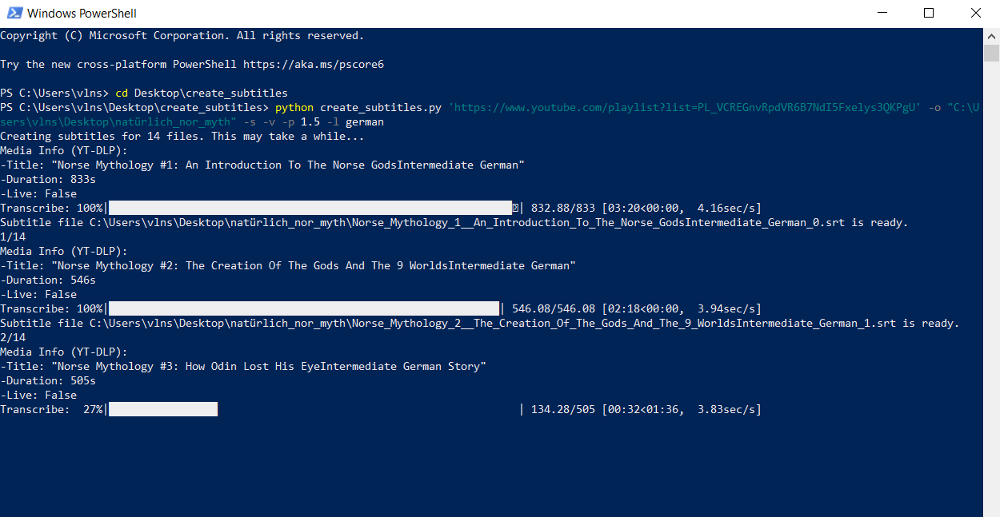

# CreateSubtitles

A command-line application to easily create subtitles for video/audio files and urls (such as youtube and dailymotion) using OpenAI's Whisper Speech to Text model.

# TL;DR ✌️
If you say: "I don't want to bother reading just tell me the easiest usage style to create quality captions", in Powershell:
 
```PS
python create_subtitles.py "C:\myGermanMovieFolder" -s -v -p 1.0 -l german
```
or if you are much of a youtube person:
```PS
python create_subtitles.py "https://www.youtube.com/playlist?list=PL_VCREGnvRpdVR6B7NdI5Fxelys3QKPgU" -o "C:\myGermanSubtitleFolder" -s -v -p 1.0 -l german
```

(Don't forget to change the 'german' keyword with the language your videos are in!)
## Setup

#### Ffmpeg
Whisper uses the brilliant command-line tool [ffmpeg](https://ffmpeg.org/) in order to manipulate media files. You can install it via commands below in case you don't have already. Also keep in mind that you may need to add it to PATH afterwards.

```
# on Ubuntu
sudo apt update && sudo apt install ffmpeg

# on Windows using Chocolatey
choco install ffmpeg

# on MacOS using Homebrew 
brew install ffmpeg
```
#### Requirements
You can install all required python libraries with:
```
pip install -r requirements.txt
```
<details>
    <summary>Or click here if you prefer to install them manually.</summary> 

#### Whisper

You can install our main Speech to Text model [whisper](https://github.com/openai/whisper) via:

```
pip install openai-whisper
```

#### Pysrt and Webvtt

[Pysrt](https://github.com/byroot/pysrt) facilitates converting texts to srt files while [webvtt](https://webvtt-py.readthedocs.io/en/latest/usage.html) does the same for vtt files. Install them with commands below:

```
pip install pysrt
pip install webvtt-py
```
#### Validators and yt-dlp

[Validators](https://pypi.org/project/validators/) is used when creating subtitles with urls, and [yt-dlp](https://pypi.org/project/yt-dlp/) when pulling videos from youtube or dailymotion:

```
pip install validators
pip install yt-dlp
```

</details>


## Usage

### Important Update 1.01!!
After discovering wonderful Python library [stable-ts](https://github.com/jianfch/stable-ts) i did some updates in order to be able work with its improved model. So if you want to create more efficient subtitles quickly using stable_whisper model, this is the way to go now:

Install stable-ts via (If you used requirements.txt to install dependencies, you don't need to do this step.):
```python
pip install -U stable-ts
```
Then use CreateSubtitles with -s command.
```python
create_subtitles.py path/to/video.mp4 -s
                or
create_subtitles.py path/to/video/folder -s
```
You can create subtitles for video/playlist url's too with this model:
```python
create_subtitles.py "https://www.youtube.com/watch?v=xvFZjo5PgG0&ab_channel=Duran" -s
                or
create_subtitles.py "https://www.youtube.com/playlist?list=PL_VCREGnvRpcq2Eh4cuo1JZcg7iKh_J2W" -s 
                or
create_subtitles.py https://www.dailymotion.com/playlist/x4yhya -s -l french
```

And if you want to use timestamps for active words:
```python
create_subtitles.py path/to/video.mkv -s -t
```
You can still use offset -more information below about how offset works- in order subtitles to stay longer via -p command (only caveat being you can not use timestamps when you are using offset):
```python
create_subtitles.py path/to/video.mkv -s -p 1
```
You can still use other commands too, for example:
```python
create_subtitles.py path/to/video.mkv -o  path/to/subtitle/folder -s -p 1 -l german -m base 
```
### If you still prefer legacy version (or want to have more information about other commands): 

Basic usage requires only a video/audio file to create subtitles for, or you can also just use a folder name instead, it will create subtitles for all available media files in that folder.
```python
create_subtitles.py path/to/video.mkv 
                or
create_subtitles.py path/to/video/directory   
```

You can declare directory you want subtitles to be created in. (If you don't use -o arguement, it will save the subtitle files into the video directory by default.)
```python
create_subtitles.py path/to/video.mp4 -o path/to/subtitle/directory
```
Default subtitle format is .srt but you can switch to .vtt by -f command. And you can declare language with -l command. If you are sure from the language of your files, it is recommended to declare languages since it improves efficiency a lot:
```python
create_subtitles.py path/to/video/directory -o path/to/subtitle/directory -l french -f .vtt
                                    or  
create_subtitles.py path/to/video/directory -o path/to/subtitle/directory -l fr -f .srt
```
-p arguement will add desired amount of (seconds) offset time to end of every subtitle instance. Since AI generated subtitle will exactly disappear when sentence is finished, it is recommended to use 0.5 to 1.5 second of offset. (If next subtitle instance comes too quickly it will keep the instance till the next one to ensure they won't crash.)
```python
create_subtitles.py path/to/video.mp4 -p 1
```
-m arguement will define the size of used speech to text model's size. It's set to 'small' by default. But whisper provides  quicker and less capable models along with slower and more complicated ones. You can see all parameters in [here](https://github.com/openai/whisper). 

Since bigger models consume considerably more VRAM, be sure your GPU is up to task before using those. You can also see the requirements in the link above.

```python
create_subtitles.py path/to/video/folder -p 0.75 -m small 
```

If you want to avoid replacing already existing subtitles -that being subtitle with the same basename as input file and intended sub extension- You can do it via 'dont-overwrite' command. This comes handy if you don't want to create all subtitles at once while dealing with larger folders. 
```python
create_subtitles.py path/to/video/folder -p 1 -spanish --dont-overwrite
```